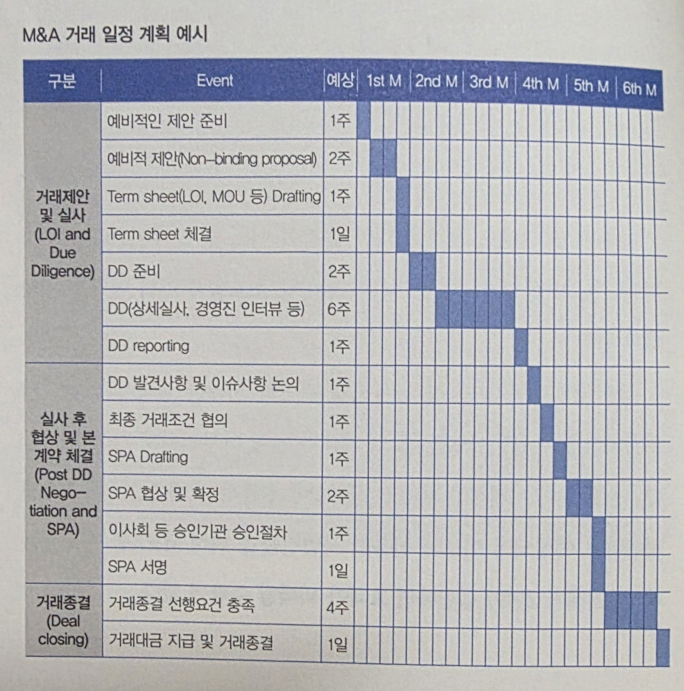
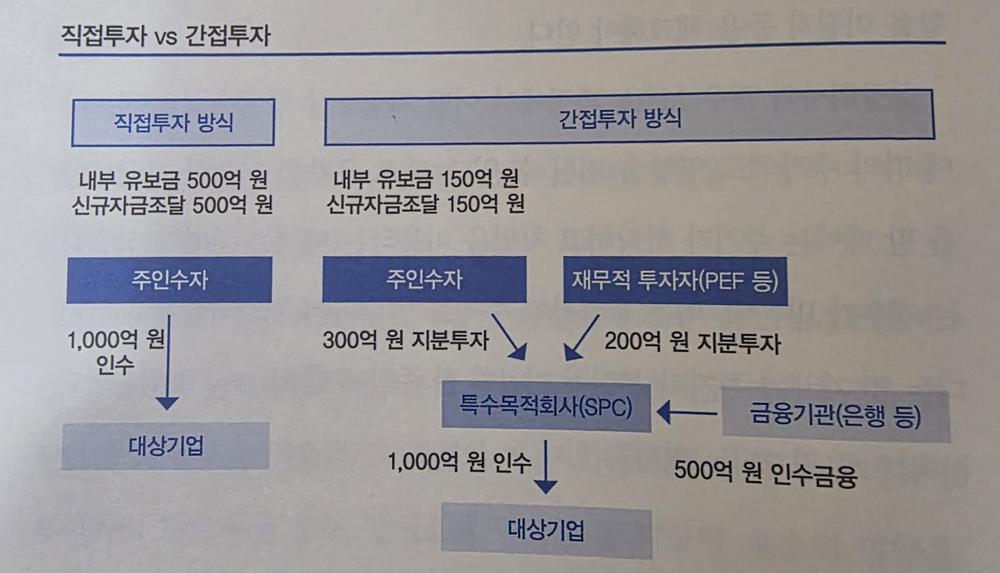

## 거래의 시작

다시 M&A 기본 정리를 이어갈 시간이다.

  + M&A 동기, 목표 및 전략의 구조화
  + 타깃 선정
  + 거래 의향 확인
  + 비밀유지확약서(CA; Confidential Agreement) 체결
  + `예비적 제안 (LOI; Letter of Intent)`
  + 텀시트 체결 (Termsheet, MOU)
  + 실사 (DD; Due Diligence)
  + 본계약 체결 및 클로징 (DA; Definitive Agreement)

이번 포스팅은 M&A 거래 일정의 계획 및 예비적 제안부터 기업 Valuation Method까지 다뤄보고자 한다.

## M&A 거래 일정의 계획

거래구조와 절차에 대한 대략적인 정리가 이루어졌다면, 신속한 M&A를 진행하기 위한 최적의 일정을 계획하는 것이 중요하다. M&A의 주요 목적은 변화하는 환경변화에 대처하기 위한 Asset을 얻기 위함인데, 정작 M&A의 시행이 느려져 Time lag가 생긴다면 M&A 시행에 따른 비용은 비용대로 지불하면서 정작 이익은 reap하지 못하게 될 것이다. 다음은 가장 일반적으로 생각해볼 수 있는 M&A 거래 일정의 순서 및 각 단계별 소요 기간이다.

::: {style="text-align: center;"}

:::

당연하게도, 거래 일정의 조율은 거래 당사자의 내부적인 상황 뿐만 아니라 외부적 요인에도 영향을 받으므로 거래 당사자는 여러 가지 변수를 염두해 계획해야 한다. 대표적으로 `대상기업의 규모`, `상장 여부`, `해외 사업장 유무`, `인수 경쟁자 존재 여부`등이 있다.

대상기업이 클수록 거래종결까지 여러 절차와 긴 시간이 소요되는 것이 일반적이다. 당연하게도 각 단계별 의사결정에 참여할 이해관계자의 절대적인 수가 많아지며, 실사 단계에서 검토할 자료의 분량 역시 커지기 때문이다. 또한, 대상기업이 상장회사라면 진행 단게별 공시의무를 검토하고 철저히 지켜야 한다. 해외 사업장이 있을 경우, 현지의 M&A 관련 규제를 철저히 조사해 신고 및 허가를 받아야 하는 사항을 확인해 계획에 포함해야 한다. 마지막으로 인수 경쟁자가 존재할 경우 투자자가 계획 수립을 주도하기 어려워진다는 점 역시 염두하고 있어야 할 것이다.

## M&A Term Sheet(LOI, MOU) 101

이제 본격적인 DD를 진행하기 위한 선제적 단계, 예비적 거래조건을 제시하는 과정이 필요하다. 전체적인 거래조건에 대한 윤곽이 제공되지 않는다면 대상기업의 입장에서 자사에 대한 세부정보를 disclose할 이유가 전혀 없기 때문이다. 투자자는 대상기업이 받아들일 만한 조건을 제시하기 위해, 이전 미팅 과정에서 각종 조건에 대한 희망 사항을 파악해두는 것이 중요하다. 이 과정을 보다 원활하게 커뮤니케이션하고 트러블을 최소화하기 위해 대리인이나 자문사를 이용하는 것이 큰 도움이 될 수 있다. 

투자자가 매도인에게 LOI를 서면으로 제시하기로 결정했다면 앞서 Deal Structuring에서 다룬 조건들을 조합한 Term sheet를 작성하면 된다. 대표적으로 *명확한 단일값*으로 명시된 **거래대상과 거래가격**, **독점적인 협상기간**, **실사 범위 및 일정**, **거래종결의 전제조건**등이 있을 것이다. 

## 자금 조달

인수자가 거래대금을 조달하는 방법은 별도의 주체(SPC)를 활용하는지에 따라 크게 직접투자와 간접투자로 나누어볼 수 있다. 

### **직접투자**

별도로 SPC를 활용하지 않고, 자금조달 비용이 낮은 재원을 우선적으로 활용해 거래대금을 조달하는 경우다. 당연하게도 자금조달의 비용은 내부 유보현금, 차입금, 유상증자의 순서로 낮다. 즉, 내부 유보 현금이 많아 우량한 보험회사의 입장에서는 SPC를 활용하기 보다는 직접투자를 활용할 가능성이 높다고 볼 수 있다. 단, 투자자는 기존 사업과 관련해 미래에 빠져나갈 자금 및 유입될 자금에 대한 사항까지 고려해서 판단을 내려야할 것이다.

### **간접투자**

만일 투자자가 거래대금을 스스로 조달하기 어렵거나, 해당 M&A건에 가급적 최소의 자금을 투자하고자 하는 경우에는 SPC를 활용하는 방법을 고려할 수 있다. SPC에 주인수자(투자자)와 재무적투자자(PE 등)가 출자 형태의 투자를 하고, 다시 그 SPC가 인수금융을 이용해 거래대금을 조달하는 구조가 많이 활용된다. 즉 예시를 들자면, 총 1000억원을 조달하기 위해 투자자가 SPC에 300억원을 출자하고, PE사가 200억원을 출자한 뒤, 해당 SPC에서 은행 등에서 500억원을 조달하는 방법을 활용하는 것이다. 여기에 더불어 재무적 투자자가 SPC에 직접적인 지분출자가 아닌 전환사채 등의 의결권이 없는 투자 형태의 구조를 설계한다면 결과적으로 투자자가 300억원의 부담만으로 대상기업의 100% 지배권을 가져오는 구조를 만들 수 있는 것이다. 

::: {style="text-align: center;"}

:::

## Valuation Methods

여러번 강조되지만, M&A에서 가장 중요한 것은 결국 합리적인 거래가격을 산출하는 것이다. Valuation method는 이를 산출하기 위한 *방법론*이며, 실사는 이를 수행하기 위한 정보를 *수집*하는 과정이다. Valuation method는 상황에 따라 달리 활용되지만, 궁극적으로는 각 방법론에 따라 평가를 진행해 종합적으로 평가하는 것이 권장된다. 대표적으로는 수익가치 접근법과 상대가치 접근법이 있으며, 각각 Discounted Cash Flow(DCF), EV/EBITDA(Multiple)으로 대표된다.

### **상대가치 접근법(Multiple)**

상대가치 접근법은 대상기업과 유사한 기업에 대한 *시장*의 평가를 기준으로 Valuation하는 방법이다. 즉, 앞선 방식의 내재적 가치 기반의 접근과는 달리, 주식시장에서 인정받은 가치에 기준을 두고 평가하는 것이다. 구체적으로는 PER, EV/EVITDA 등의 Multiple을 측정하고 이를 대상기업에 적용하여 평가하는 식이다. 이는 대상기업에 대한 시장의 최근 평가를 잘 반영할 수 있으며 직관적이라는 장점이 있기에 가장 많이 활용되는 평가 방법이다. 특히 재판매 가능성이 중요한 FI 투자자의 관점에서는 시장의 평가가 중요하므로 더욱 주요하게 고려해야할 평가법이 될 수 있다.

구체적인 방법론으로는 유사거래 비교법을 사용하는 것이 가장 추천된다. M&A 거래에는 경영권이 포함되기에 주가를 기준으로하는 유사*회사* 비교법을 적용할 경우 해당 업종의 경영권 프리미엄 수준을 반영하기 어렵다는 한계가 있다. 따라서 동종업계 유사 기업의 최근 *경영권 거래*에서 도출된 배수를 이용해 평가하는 것이 가장 적절할 것이다. 예를 들면 대상기업과 유사한 기업이 1000억원에 경영권이 거래가 됐고 당시 그 기업의 EBITDA가 100억원이었다면 여기서 도출되는 EV/EBITDA 배수는 10이 된다. 만약 평가하고자 하는 대상기업의 EBITDA가 200억원이라면 해당 배수를 적용해 대상기업의 기업가치를 2000억원으로 평가하는 것이다. 여기서 자연스레 중요한 것은 `1. 유사거래의 선정`과 `2. 배수의 적용`이다.

#### **유사거래의 선정**

유사거래 비교법에서 가장 중요한 것은 어떤 유사거래를 선정할 것인지이다. 대상기업과 동일한 사업, 규모, 시장 내 포지션 등을 고려해서 선정하는 것이 베스트일 것이다. 유사한 거래를 찾기 어렵다면 해외 거래를 참고하거나, 경영권이 포함되지 않은 거래를 활용한 뒤 경영권 프리미엄을 추가적으로 고려하는 차선책을 활용할 수 있을 것이다.

#### **배수의 적용**

유사거래를 선정했다면 어떤 Multiple을 적용할 것인지 정해야 한다. 일반적으로는 매출액, 영업이익, EBITDA 등의 재무지표를 활용하는 것이 일반적이지만, 재무지표가 없거나 비재무지표가 더 적합하다고 판단된다면 전문인력 수, MAU, 가입자 수 등을 활용할 수도 있다. 가장 많이 활용되는 것은 EBITDA인데, 이는 통상 기업의 CF 창출 능력을 나타내 이해가 쉽고 투자자의 투자 회수 기간이나 차입금 부담 능력 등을 가늠해볼 수 있다는 측면에서 많이 활용된다.

### **수익가치 접근법(DCF)**

수익가치 접근법은 대상기업의 *수입 창출 능력*에 초점을 맞춘 접근법이다. DCF는 대상기업이 앞으로 벌어들일 수익을 추산하고, 이를 할인해 얻은 현재가치의 합으로 Valuation하는 방식이다. 이 방법은 미래의 매출, 비용, 투자금액 등을 포함해 최소 5년간의 CF를 추정하며, CAPM등을 활용해 적합한 할인율을 산정해야 한다는 도전을 마주한다. 이는 기업의 내재가치에 대한 기준치로 실무상 많이 쓰는 방법이다. 특히 SI 투자자의 관점에서는 시너지 기잔의 CF 확보가 중요하므로, 미래현금흐름 기반 추정인 DCF 방법을 주축으로 두고, 시장 평가 대비 Overvalue 여부를 방지하기 위해 상대가치 접근법을 보조적으로 활용하는 방식이 유용할 것이다.

구체적으로는 다음과 같은 수식을 통해서 기업가치(EV)를 산출한다고 볼 수 있다.

$EV = \sum_{t=1}^{n} \frac{FCF_t}{(1 + WACC)^t}$

여기서 EV는 기업가치(Enterprise Value), FCF는 영업현금흐름(Free Cash Flow), WACC은 가중평균자본비율(Weighted Average Cost of Capital, 할인율)을 의미한다. 수식을 통해 DCF 가치평가의 핵심은 `1. FCF의 역추산`과 `2. WACC의 도출`에 있다는 점을 알 수 있다.

#### **FCF의 역추산**

FCF의 수식은 다음과 같다. 해당 수식을 구성하는 요소들을 영업이익에서 출발해 오른쪽으로 하나씩 요소를 추가해가며 역추산한다는 의미로 이해해보자. 

$FCF = EBIT*(1-t) + Dep - (\Delta NWC + CapEx)$

1. $EBIT$: 올해 발생한 매출액에서 해당 매출을 창출하기 위해 발생한 비용을 제외한 영업이익이다. 본 영업이익은 채권자에게 지급할 이자와 주주에게 지급할 배당금을 포함하고 있다. 

2. $EBIT*(1-t)$: 과세대상 이익에 대해 세금이 부과된다. 세금은 실질적인 현금유출이므로 영업이익에서 제외된다.

3. $EBIT*(1-t) + Dep$: 고정자산에 대한 감가상각비는 실제 현금으로 유출된 비용이 아니다. 고정자산에 대한 비용 지출은 현금흐름표에서 이미 인식했다. 실제 현금흐름을 반영하려면 본 감가상각비는 영업이익에 다시금 더해져야한다.

4. $EBIT*(1-t) + Dep - (\Delta NWC + CapEx)$: 투자는 크게 두 가지로 구성된다. 하나는 매출액이 증가함에 따라 증가하는 운전자본 투자이며, 다른 하나는 미래 추가적인 수익 증대를 위한 자본적지출이다. 본 투자를 제외함으로서 비로소 주주와 채권자에게 귀속되는 현금만이 남게 된다.

한마디로 정리하면, 매출에서 비용, 세금, 재투자를 제한 다음 감가상각비를 더하면 주주와 채권자에게 귀속되는 현금흐름이 되며, 이것을 FCF라고한다. 

#### **WACC의 도출**

WACC의 수식은 다음과 같다. 해당 수식을 구성하는 요소들과 CAPM을 참고해 이를 이해해보자. 

$WACC = \left( \frac{E}{E+D} \times r_e \right) + \left( \frac{D}{E+D} \times r_d \times (1 - t) \right)$

1. $WACC$: 가중평균자본비용이란 회사가 조달한 타인자본과 자기자본을 시장가치로 환산해 각 자본비용을 비중대로 가중평균한 것이다. FCF는 주주와 채권자의 가치를 합한 회사가치이므로 두 가지 비용을 가중 평균해야하는 것이다.

2. $\left( \frac{E}{E+D} \times r_e \right)$: 자기자본비용을 부채의 시장가치 및 자기자본의 시장가치를 기준으로 가중치를 부여한 것이다.

3. $\left( \frac{D}{E+D} \times r_d \times (1 - t) \right)$: 세후 부채비용을 부채의 시장가치 및 자기자본의 시장가치를 기준으로 가중치를 부여한 것이다.

4. $r_e = r_f + \beta \times (r_m - r_f)$: 자기자본비용의 경우, CAPM을 활용해서 산출한다. 부채비용의 경우 일반적으로 대상기업의 연간보고서를 참고하며, 없을 경우 손익계산서의 이자비용을 재무상태표의 금융부채 총액으로 나누어 대략적인 수치를 얻을 수 있다.

## 마무리

이번 포스팅은 대표적인 두가지 Valuation Method에 대해 다루는 것으로 마무리다. 다음 포스팅은 DD 과정과 고려해야할 사항들을 중점적으로 다룰 예정!