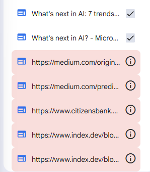
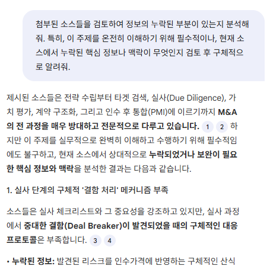
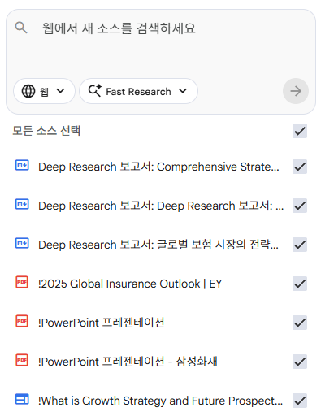
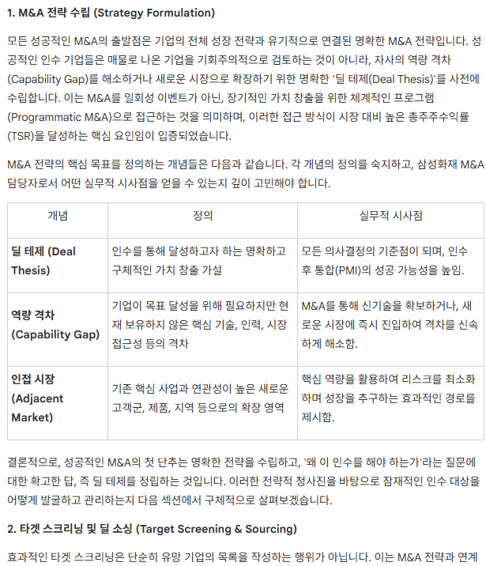

In this post, I will document my first use case of NotebookLM in conducting a quick study for strategic M&A in the insurance sector. My notebook can be found [here](https://notebooklm.google.com/notebook/b1d6387f-b9d3-4e80-a96f-b530ecfd1c34).

## Step1: Finding, Cleansing, Prioritizing the Sources 

Before searching for sources, you need to structure what your objective is. In my case, the main goal was to ***Create a Report/Manual for associates in the Cross-border M&A department in SFMI***. This can be branched into two sub-goals which are **Overview of the end-to-end M&A Process** and **Conduct a detailed analysis of SFMI's Global P/F and Bolt-on M&A strategies**.

Then, use the *Deep Research* feature to conduct research on the determined sub goals. This should take 3~5 minutes per task, and yield upto 500 sources depending on how many sub-goals you have determined. Retrieve all found sources, and eliminate the false sources depicted red.

::: {style="text-align: center;"}

:::

Although we have gathered a lot of sources, these sources may be insufficient. We need to conduct analysis on gathered sources and determine if there are any loose ends, or insufficient coverage on some topics. Use the chat window in the middle to conduct said analysis. Copy the result and feed it to *Deep Research* to reinforce our sources.

::: {style="text-align: center;"}

:::

Now, we need to cleanse and prioritize our sources. Ask NotebookLM to create a table that labels the sources on Date, Author, Source Type(primary, secondary, columns etc...). Remove sources that may be outdated, or unreliable depending on your project. Then, ask Notebook LM to extract 5 most prominently mentioned themes or key perspectives and organize them into a table. Find those sources in the left source list and modify their names to include **!** in the beginning, so that they show up at the top of the list.

::: {style="text-align: center;"}

:::

At this point, we have successfully conducted desk research, cleansed the data, and prioritized them based on our project's objective. The next step is to utilize our sources to create whatever we need in a specific format. In my case, it would be a Report/Manual.

## Step 2: Utilizing Sources to Create a End-Product

Now, we can use our sources and make NotebookLM create whatever we need in the format of reports, mindmaps, slides and so on. In my case, I will use the 10 essential sources to create a Report. Select the said sources and use the Report feature in the studio. Add descriptions to make sure NotebookLM understands your objective and desired format.

::: {style="text-align: center;"}

:::

## Thoughts

It seems that NotebookLM's value resides in two points. **1. Listup of desk research sources and primary cleansing & prioritization.** **2. Creating comprehensive overviews for quick studies.** Getting a quick grasp of what you want to study with NotebookLM and reinforcing specific topics with books or internal materials seems to be an efficient way for associates to find starting points for study.