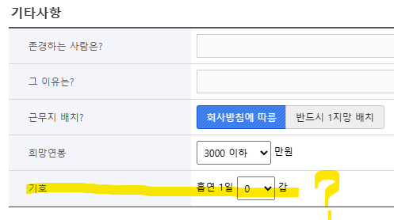

Getting a job in 2025 was a major pain in the ass; the job market and myself both at fault. My specific career preference for global corp dev narrowed down my applicable job openings, and the declining hire volumes reduced my chances of landing an interview. To cut it short, I ended up with 15 resume applications, 4 interview requests, and 2 final offers.

## The Resume Grind

*For my previous experience details, check out my CV in the main page*

To sum up my previous intern experience, I worked as a overseas sales intern for a small medical instrument manufacturing company, an investment intern for a Corporate Venture Capital, and a RA for a consulting firm. Melting them down to keywords would be: `Global Business`, `SI/FI Investments`, and `Business Strategy`. Having intern experience in overseas sales, venture capital and consulting is good and all, but its not a great fit for mass-applying in the South-Korean job market. Most job openings for Business Management undergrads accumulate to marketing and sales, and a rare pinch of misc job posts.

Even though marketing has the greatest amount of hire for most companies, they also require specific skill sets and portfolios to back them up. Having none of these meant that I had no competitiveness in this sector. That basically meant *sayonara* to the **50%** of job openings for me. For sales, although I have a bit of experience, it was pretty clear to me that the culture fit between me and the sales department was a mile long. Well, there goes an another **40%**. TLDR; I was going to have to fight for my chances in the **10%** of all job openings. A pretty grim start.

Working with the remaining 10%, I had to find job posts that fit my keywords. Of the three, the most generally applicable keyword was `Global Business` and `Business Strategy`. Some examples were: 

  + Samsung Fire & Marine Insurance Global Business Development Role
  + Hyundai Capital Global Business Management Role
  + Korean Air General Hire
    - *hire first, distribute later kind of hire*
  + Orion Snacks Global Procurement Role
  + Hyundai Card Product Development Role
  + ..... to a total of 15 applications

This total of 15 applications still included some roles like Global Marketing and Financial Accounting that I felt less competitive in. Why did I still apply? Well, #1 because I was desperate and #2 in hope to get more interview experience. Anyway, after a long wait I got 4 interview requests from these roles:

  + Samsung Fire & Marine Insurance Global Business Development Role
  + Hyundai Capital Global Business Management Role
  + Korean Air General Hire
  + Orion Snacks Global Procurement Role

A 27% win rate doesn't really cheer you up. Especially when you have *superb*  colleagues making 40~50% out of theirs. Now, time to analyze my success and failures. 

#### Success

  + Samsung Fire & Marine Insurance Global Business Development Role
    - `Global Business`, `SI/FI Investments`, `Business Strategy`
  + Hyundai Capital Global Business Management Role
    - `Global Business`, `Business Strategy`
  + Korean Air General Hire
    - `Global Business`, *Preference for SNU Undergrads*
  + Orion Snacks Global Procurement Role
    - `Global Business`, `Business Strategy`

#### Failure

  + Hyundai Card Product Development Role
    - `Business Strategy`
  + CJ Olive Young Global Marketing
    - `Global Business`
  + Kakaopay Platform Business
    - `Business Strategy`
  + Lotte Wellfoods Global Strategy
    - `Global Business`, `Business Strategy`, *Aversion for SNU Undergrads*

In the end, it boils down to two major differences; **JD Fit** and **Culture Fit**. JD Fit being the amount of job experience keywords that befit the position's JD, and Culture Fit regarding the firm's overall qualitative tendency that could favor/dislike you. I generally got interview offers from positions with two or more befitting keywords, or firms that have strong tendencies to favor certain aspects of my qualifications. On the other hand, I had no luck from positions with weak ties with my keywords, or firms that have strong tendencies to dislike certain aspects of my qualifications. More on this matter at the **Reflections / Thoughts**.

Before moving on, let me show you one of the *strangest*  resume requirements of a small~middle sized firm. Just for shits and giggles.

Like... WTF? Just one of many strange requirements out there, mostly for old - middle sized firms. When rummaging through the job posts in the korean job market, there are a surprising lot of resume requirements like these.

## Interviews

For my interviews...

## Final Offer Decisions

## Reflections / Thoughts